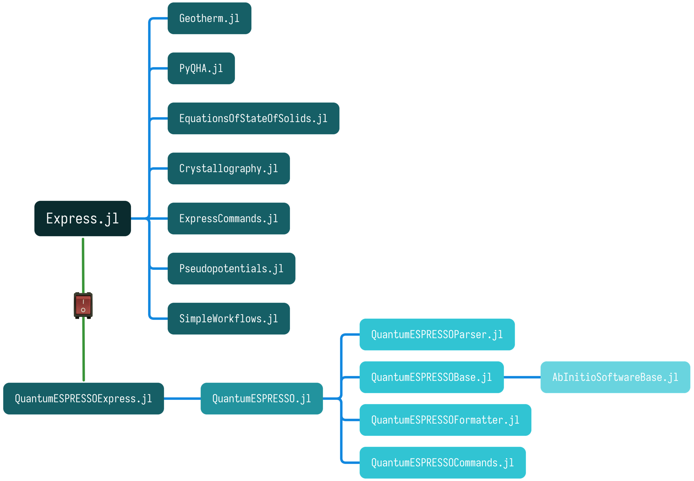

```@meta
CurrentModule = Express
```

# Express: an extensible, lightweight, high-throughput, high-level workflow framework that aims to automate _ab initio_ calculations

Documentation for [Express](https://github.com/MineralsCloud/Express.jl).

## Package Features

`Express` is an extensible, high-throughput, high-level workflow framework that aims to
automate _ab initio_ calculations for the materials science community. `Express` is shipped
with well-tested workflow templates, including structure optimization, equation of state
(EOS) fitting, phonon spectrum (lattice dynamics) calculation, and thermodynamic property
calculation in the framework of the quasi-harmonic approximation (QHA). It is designed to be
highly modularized so that its components can be reused across various occasions, and
customized workflows can be built on top of that.

The differences between `express` and `Express`:
`express` is the project's name, it is a collection of Julia packages.
Its core is `Express.jl`, managing and dispatching the rest packages.
`Express` is short for `Express.jl`, which is the most important component of `express`.
The direct components of `express` are:



- [`Express.jl`](https://github.com/MineralsCloud/Express.jl) provides a high-level
  interface to all the workflows, including file reading and writing, job creation,
  submission, monitoring, result retrieving, and data analysis. To work with specific
  software, install the corresponding plugin, e.g., `QuantumESPRESSOExpress.jl` for Quantum
  ESPRESSO.

- [`ExpressCommands.jl`](https://github.com/MineralsCloud/ExpressCommands.jl) is a
  user-friendly command-line interface of `Express.jl` for non-developers. It installs an
  executable '`xps`' that can execute code from configuration files provided by users.

- [`EquationsOfStateOfSolids.jl`](https://github.com/MineralsCloud/EquationsOfStateOfSolids.jl)
  fits energy (or pressure) vs. volume results to equations of state, etc. These features
  are repetitively used in the equation of state workflow.

- [`Crystallography.jl`](https://github.com/MineralsCloud/Crystallography.jl) calculates a
  crystal's primitive cell (or supercell) volume from lattice parameters, finds symmetry
  operations and generates high symmetry points in the Brillouin zone, etc.

- [`PyQHA.jl`](https://github.com/MineralsCloud/PyQHA.jl) is a Julia wrapper of the
  Python [`qha` package](https://github.com/MineralsCloud/qha), which can calculate
  several thermodynamic properties of both single- and multi-configuration crystalline
  materials in the framework of quasi-harmonic approximation (QHA). The `qha` code is the
  foundation of the QHA workflow.

- [`Geotherm.jl`](https://github.com/MineralsCloud/Geotherm.jl) is a Julia interpretation
  of the Fortran code we used in
  [this paper](https://agupubs.onlinelibrary.wiley.com/doi/full/10.1002/2017GL073294), which
  calculates the isentropic temperature/pressure gradient (geotherm) using thermodynamic
  properties obtained with the QHA workflow.

- [`Pseudopotentials.jl`](https://github.com/MineralsCloud/Pseudopotentials.jl) presents a
  database for storing and querying pseudopotentials used in _ab initio_ calculations.

- [`SimpleWorkflows.jl`](https://github.com/MineralsCloud/SimpleWorkflows.jl) is the
  skeleton of the workflow system, which defines building blocks, composition rules, and
  operation order of workflows.

The
[`QuantumESPRESSOExpress.jl`](https://github.com/MineralsCloud/QuantumESPRESSOExpress.jl) is
a special type of package called "plugin of `express`" for handling _ab initio_ software
such as Quantum ESPRESSO. Other plugins for other software are possible. The dependencies of
`QuantumESPRESSOExpress.jl` are listed below.

- [`AbInitioSoftwareBase.jl`](https://github.com/MineralsCloud/AbInitioSoftwareBase.jl)
  provides a standard API for some popular _ab initio_ software such as Quantum ESPRESSO.

- [`QuantumESPRESSOBase.jl`](https://github.com/MineralsCloud/QuantumESPRESSOBase.jl)
  declares basic data types and methods for manipulating crystal structures, generating
  input files for Quantum ESPRESSO, error checking before running, etc.

- [`QuantumESPRESSOParser.jl`](https://github.com/MineralsCloud/QuantumESPRESSOParser.jl)
  parses the input or output files of Quantum ESPRESSO to extract and analyze data.

- [`QuantumESPRESSOFormatter.jl`](https://github.com/MineralsCloud/QuantumESPRESSOFormatter.jl)
  formats the input files of Quantum ESPRESSO.

- [`QuantumESPRESSOCommands.jl`](https://github.com/MineralsCloud/QuantumESPRESSOCommands.jl)
  is a command-line interface that exports the commands Quantum ESPRESSO uses in a
  configurable way.

- [`QuantumESPRESSO.jl`](https://github.com/MineralsCloud/QuantumESPRESSO.jl) is simply a
  wrapper of the types, methods, and commands defined in `QuantumESPRESSOBase.jl`,
  `QuantumESPRESSOParser.jl`, `QuantumESPRESSOFormatter.jl`, and
  `QuantumESPRESSOCommands.jl` under a common namespace.

## Installation

The package can be installed with the Julia package manager.
From the Julia REPL, type `]` to enter the Pkg REPL mode and run:

```
pkg> add Express
```

Or, equivalently, via the `Pkg` API:

```julia
julia> import Pkg; Pkg.add("Express")
```

## Documentation

- [**STABLE**](https://MineralsCloud.github.io/Express.jl/stable) &mdash; **documentation of the most recently tagged version.**
- [**DEV**](https://MineralsCloud.github.io/Express.jl/dev) &mdash; _documentation of the in-development version._

## Project Status

The package is tested against, and being developed for, Julia `1.6` and above on Linux,
macOS, and Windows.

## Questions and Contributions

Usage questions can be posted on
[our discussion page](https://github.com/MineralsCloud/Express.jl/discussions).

Contributions are very welcome, as are feature requests and suggestions. Please open an
[issue](https://github.com/MineralsCloud/Express.jl/issues)
if you encounter any problems. The [contributing](@ref) page has
a few guidelines that should be followed when opening pull requests and contributing code.

## Manual Outline

```@contents
Pages = [
    "installation.md",
    "contributing.md",
    "run/configuration.md",
    "run/cli.md",
    "run/jobs.md",
    "troubleshooting.md",
    "faq.md",
]
Depth = 3
```

## Library Outline

```@contents
```

### [Index](@id main-index)

```@index
```
