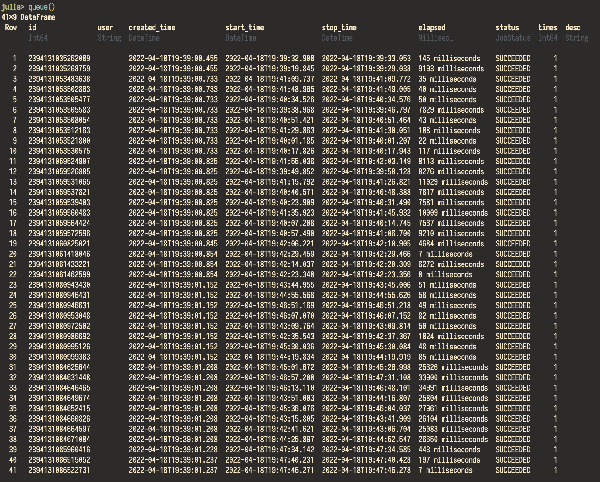

# Tracking and monitoring jobs in a workflow

Tracking job status, input parameters, and output results manually
are time-consuming and error-prone.
In `Express.jl`, each job's unique ID, start time, stop time,
status (whether it succeeded, failed, is running or pending),
in the workflow are stored in a database for future reference or sharing information
with colleagues.

This database is a `DataFrame` object implemented by
[`DataFrames.jl`](https://github.com/JuliaData/DataFrames.jl).
It supports all operations that a `DataFrame` permits, including
listing, sorting, filtering, and modifying.
Users can interact with it directly in Julia
(Please see its [documentation](https://dataframes.juliadata.org/stable/)
for more information.).

The database can also be stored in a file for future reference or sharing information with
colleagues.

```julia-repl
julia> using SimpleWorkflows, Serialization

julia> queue()

julia> serialize("table.jls", queue())
```


